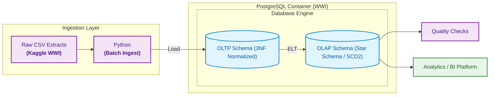

# ASB Case Study 3 – Building an End-to-End Data Engineering Pipeline

This project implements a [case study from the Analytics Solutions Bootcamp (Josh Dev PH)](https://github.com/imjbmkz/analytics-solutions-bootcamp/blob/main/03_case_study/03_cs_data_engineering.md) of building a data engineering pipeline using the [Wide World Importers (WWI)](https://learn.microsoft.com/en-us/sql/samples/wide-world-importers-what-is?view=sql-server-ver15) dataset. The specific implementation limits the scope to sales analytics.

### Related Links for Discussion

- [Answers to solution questions](docs/discussion.md)
- [Sample SCD Type 2 processing discussion](docs/scd2-demo-discussion.md)
- [Sample log for running the pipeline](docs/pipeline_session.log)

### Reference Links

- [Wide World Importers CSV dataset](https://www.kaggle.com/datasets/pauloviniciusornelas/wwimporters)
- [WideWorldImporters OLTP database catalog](https://learn.microsoft.com/en-us/sql/samples/wide-world-importers-oltp-database-catalog?view=sql-server-ver15)
- [WideWorldImportersDW OLAP database catalog](https://learn.microsoft.com/en-us/sql/samples/wide-world-importers-dw-database-catalog?view=sql-server-ver15)

## Setup

1. Fork the repository then clone locally on your machine.
2. [Download and install uv](https://docs.astral.sh/uv/#installation)
3. [Download and install Docker](https://docs.docker.com/get-started/get-docker/)
4. While in the working directory, follow the following commands:

```bash
# Create virtual environment
uv venv --python 3.14

# Sync virtual environment to install dependencies
uv sync

# Optional: Include packages from dependency groups
uv sync --group dev

# Create your .env from the template
cp .env-example .env

# Initialize containers
docker compose up -d

# Launch pipeline
uv run pipeline.py
```

The database container can be viewed and queried using [pgAdmin](https://www.pgadmin.org/) (defined in the compose file) or with any applicable database management tool e.g. [DBeaver](https://dbeaver.io/).

## Directory Overview

```markdown
cs3-de/
├── analytics/                              # Queries for answering sample business questions
├── data/                                   # Directory for raw data files
├── docs/                                   # Discussion notes
├── query/                                  # Core pipeline queries
│   ├── sc2-demo/                           # Queries for SCD Type 2 processing demo
│   ├── 01_init_oltp.sql
│   ├── 02_init_olap.sql
│   ├── 03_load_dim_date.sql
│   ├── 04_insert_unknowns.sql
│   ├── 05_load_dim_scd1.sql
│   ├── 06_customer_scd2.sql
│   └── 07_load_facts.sql
├── results/                                # Query results (business questions, SCD Type 2 demo)
├── .env                                    # Real key sample, NEVER commit this
├── .env-example                            # Template, commit this
├── check_quality.py                        # Sample data quality check
├── compose.yaml                            # Compose for running containers
├── db_util.py                              # Database utility functions
├── ingest_oltp.py                          # Ingestion script
├── inspect_data.ipynb                      # Reference notebook for initial exploration
├── pipeline.py                             # Orchestration script
└── pyproject.toml                          # Project configuration file
```

## Diagrams

### Pipeline Architecture



### Schemas

- [View OLTP Schema](docs/diagram-oltp.md)
- [View OLAP Schema](docs/diagram-olap.md)
