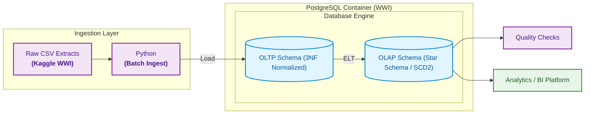

# [ASB Case Study 3 – Building an End-to-End Data Engineering Pipeline](https://github.com/imjbmkz/analytics-solutions-bootcamp/blob/main/03_case_study/03_cs_data_engineering.md)

[Answers to solution questions](docs/discussion.md)

## Directory Layout

```markdown
cs3-de/
├── analytics
│   ├── results
├── data
│   └── raw
├── docs
├── query
│   └── sc2-demo
├── .env
├── .env-example
├── check_quality.py
├── compose.yaml
├── db_util.py
├── ingest_oltp.py
├── inspect_data.ipynb
└── pipeline.py
```

## Diagrams

### Pipeline Architecture



### Schemas

- [View OLTP Schema](docs/diagram-oltp.md)
- [View OLAP Schema](docs/diagram-olap.md)
