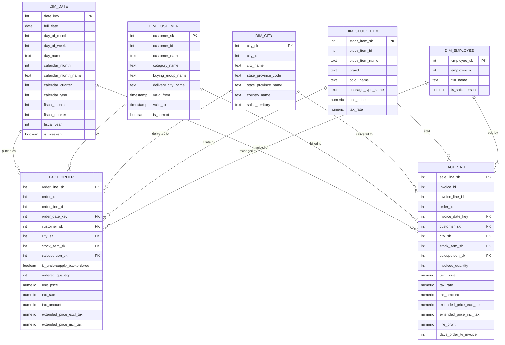

# OLAP Schema

The OLAP schema forms a constellation schema (two fact tables sharing a conformed dimensional core):

1. **Conformed Dimensions:** Five shared dimension tables integrate with both business processes. `dim_date` handles calendar and fiscal reporting periods; `dim_city` denormalizes cities, provinces, and countries; `dim_stock_item` flattens item specifications, packaging, and colors; and `dim_employee` captures staff representatives.
2. **Slowly Changing Dimension (SCD Type 2):** `dim_customer` tracks historical changes over time using validity windows (`valid_from`, `valid_to`) and an `is_current` active flag. Fact pipeline joins resolve against the customer record valid at transaction time using half-open date intervals.
3. **Fact Orders:** Grain is one row per order line (`order_line_sk`). It tracks fulfillment metrics, order quantities, price totals with and without tax, and backorder flags.
4. **Fact Sales:** Grain is one row per invoice line (`sale_line_sk`). In addition to sales quantities, invoice prices, and tax metrics, it stores line-level profitability (`line_profit`), process lag (`days_order_to_invoice`), and a degenerate order reference (`order_id`) linking back to the originating order.

