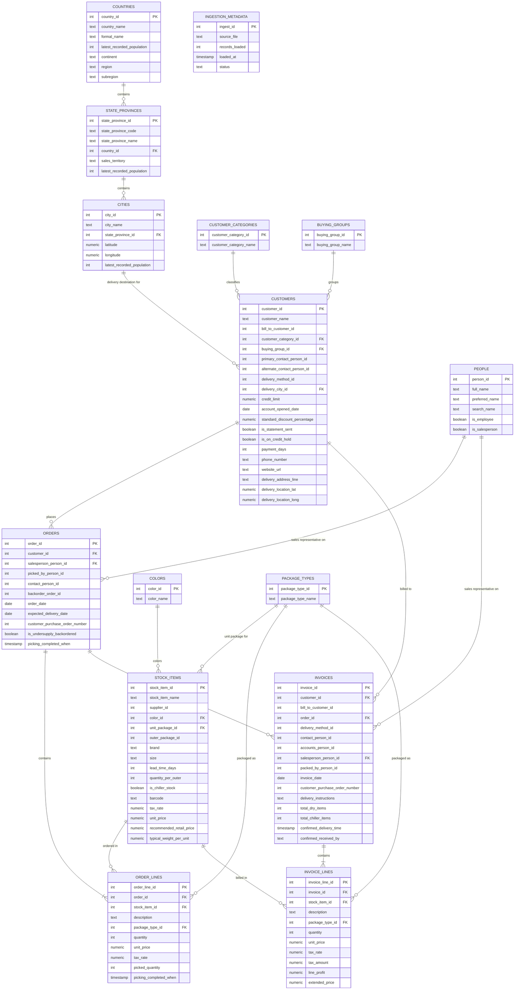

# OLTP Schema

The OLTP schema is organized into four functional domains:

1. **Geographic Hierarchy:** `countries` forms the root of geographic validation. Each country cascades down to `state_provinces`, which in turn associates with `cities`. These cities link directly to `customers.delivery_city_id` for order logistics.
2. **Customer & Organization Entities:** `customers` maps to classification entities `customer_categories` and `buying_groups` via direct foreign keys. It also contains logical identifier references to `people` (`primary_contact_person_id`, `alternate_contact_person_id`) and self-references (`bill_to_customer_id`).
3. **Product Catalog:** `stock_items` joins `colors` (for variant color tagging) and `package_types` via `unit_package_id`.
4. **Transactional Pipeline:** `orders` and `invoices` share dual integration patterns. Both tie back to `customers` and `people` (`salesperson_person_id`). Child tables `order_lines` and `invoice_lines` capture transaction line items linked back to `stock_items` and `package_types`. `_ingestion_metadata` is an independent utility table tracking pipeline execution.

